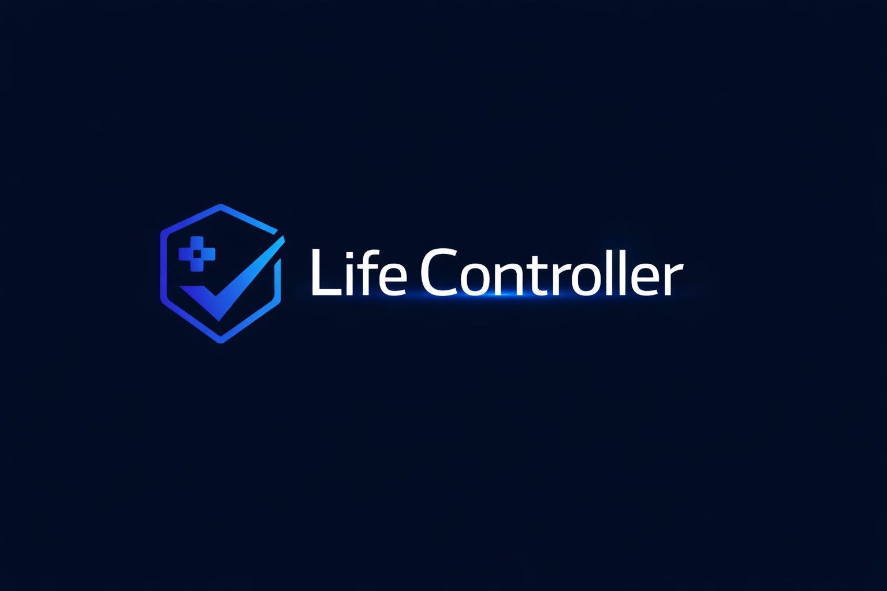
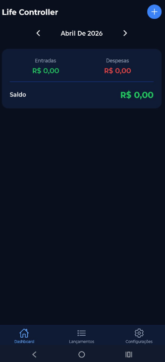

# Life Controller

<p align="center">
  
</p>

App mobile pessoal para centralizar o gerenciamento do dia a dia. O primeiro módulo — e coração do app — é o **controle financeiro**, substituindo uma planilha Excel com registro manual de lançamentos mensais.

<p align="center">
  
</p>

---

## Controle Financeiro

O módulo financeiro organiza entradas e despesas por mês, com categorias que refletem o fluxo real do orçamento pessoal:

| Categoria | Tipo |
|---|---|
| Despesas Fixas | Saída |
| Parcelas no Cartão | Saída |
| Transporte | Saída |
| Despesas Avulsas | Saída |
| Alimentação | Saída |
| Lazer | Saída |
| Entradas | Entrada |

### Como funciona

- **Navegação por mês** — avance ou recue entre os meses com as setas do painel
- **Resumo no topo** — total de entradas, total de despesas e saldo do mês em destaque
- **Lançamentos por categoria** — cada categoria exibe o subtotal e pode ser expandida para ver os itens
- **CRUD completo** — crie, edite ou exclua qualquer lançamento
- **Status do lançamento** — marque como pago, pendente ou agendado
- **Persistência local** — todos os dados ficam no dispositivo, sem servidor

---

## Identidade Visual

O app usa uma paleta de tons escuros com destaque em azul:

| Token | Hex | Uso |
|---|---|---|
| Background | `#0A0F1E` | Fundo das telas |
| Surface | `#0F1B35` | Cards e painéis |
| Primary | `#3B82F6` | Botões e ações principais |
| Accent | `#60A5FA` | Destaques e links |
| Success | `#22C55E` | Entradas e saldo positivo |
| Danger | `#EF4444` | Despesas e saldo negativo |

---

## Stack

- **Expo SDK 54** / React Native 0.81 / React 19
- **Expo Router 6** — navegação file-based
- **Zustand** — estado global
- **AsyncStorage** — persistência local

---

## Como rodar localmente

```bash
npm install
npx expo start
```

Escaneie o QR com o app **Expo Go** (iOS ou Android).

---

## Gerar APK (Android — build local)

```bash
# 1. Gerar a pasta android/
npx expo prebuild --platform android --clean

# 2. Criar android/local.properties com o caminho do Android SDK
echo "sdk.dir=C\:\\Users\\<seu-usuario>\\AppData\\Local\\Android\\Sdk" > android/local.properties

# 3. Gerar o APK
cd android && ./gradlew assembleRelease
```

O APK será gerado em `android/app/build/outputs/apk/release/app-release.apk`.

---

## Estrutura do projeto

```
app/
  (tabs)/
    index.tsx         # Dashboard — resumo + categorias
    transactions.tsx  # Lista cronológica de lançamentos
    settings.tsx      # Estatísticas e gerenciamento de dados
  transaction/
    new.tsx           # Formulário de nova transação
    [id].tsx          # Editar / excluir transação
components/           # Componentes reutilizáveis
store/                # Zustand store com persistência
hooks/                # useTransactions, useMonthSummary
types/                # Interfaces TypeScript
utils/                # Cálculos de totais e formatação
constants/            # Categorias, labels e cores
```

---

## Dados

Todos os dados são armazenados localmente no dispositivo via `AsyncStorage`. O app suporta exportação e importação de dados em formato JSON pela tela de configurações.
